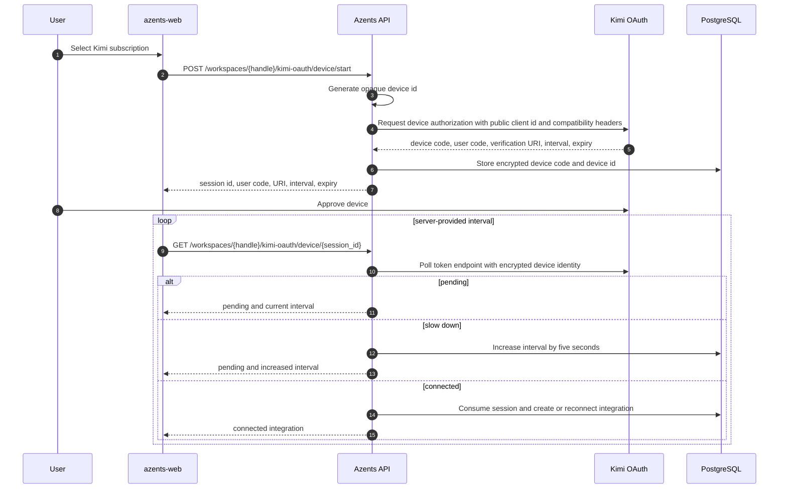
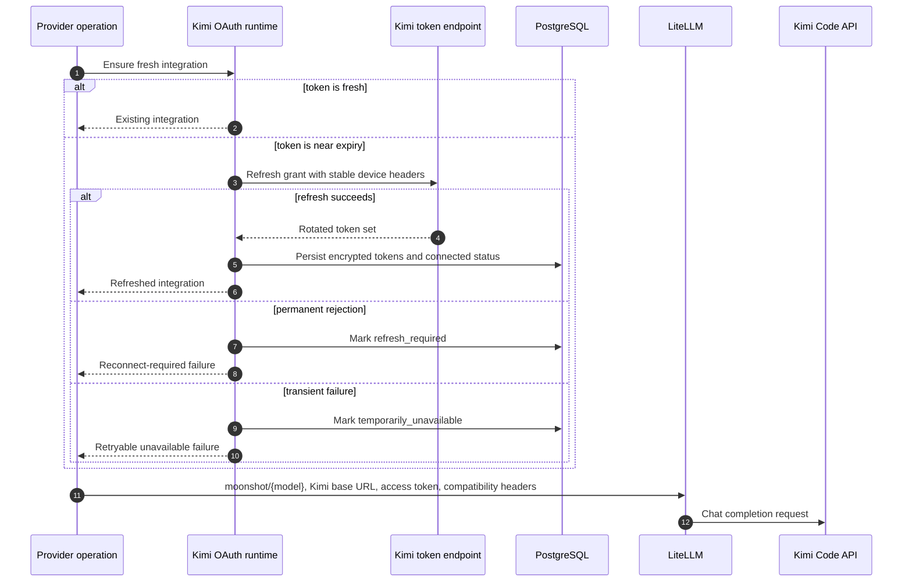

# Kimi OAuth Flow

## Overview

Kimi OAuth is an experimental workspace-scoped provider connection that lets Azents use a
user-authorized Kimi Code subscription. Its provider value is `kimi_oauth`, separate from any
Moonshot developer API-key integration because the subscription credential has its own authorization,
refresh, model-entitlement, quota, and recovery lifecycle.

The provider capability endpoint advertises Kimi as an OAuth subscription provider. Users connect it
through the existing LLM Settings add-integration modal. Generic integration create and update
requests do not accept Kimi, ChatGPT, or xAI OAuth credentials; provider-specific OAuth routes are the
only public path that can establish or replace those encrypted credentials.

## Provider Constants and Compatibility Identity

| Value | Current setting |
|---|---|
| OAuth issuer | `https://auth.kimi.com` |
| public client id | `17e5f671-d194-4dfb-9706-5516cb48c098` |
| device authorization | `https://auth.kimi.com/api/oauth/device_authorization` |
| token endpoint | `https://auth.kimi.com/api/oauth/token` |
| Kimi Code API root | `https://api.kimi.com/coding/v1` |
| compatibility version | `1.49.0` |

The client id is a public native-application identity and is not stored as a secret. Device, token,
model, usage, and runtime requests share the following compatibility headers:

- `X-Msh-Platform: kimi_cli`;
- the pinned compatibility version;
- fixed product-neutral device name and model values;
- host OS family and release after non-ASCII characters are removed;
- the encrypted stable device id.

Controlled environments may override the device endpoint, token endpoint, Kimi Code API root, and
compatibility version. Empty or non-ASCII-only header values are normalized to a safe non-empty ASCII
value.

## Data Model

`KimiOAuthSession` stores an in-progress device authorization.

| Field | Meaning |
|---|---|
| `workspace_id`, `user_id` | session owner checked on every poll and cancel |
| `method` | currently only `device` |
| `status` | `pending`, `connected`, `cancelled`, `expired`, or `failed` |
| `encrypted_device_code` | provider device code encrypted with the credential cipher |
| `encrypted_device_id` | stable generated device identity encrypted with the credential cipher |
| `user_code` | user-entered code returned to the browser |
| `verification_uri` | provider approval page returned to the browser |
| `interval_seconds` | current server-authoritative polling interval |
| `expires_at` | provider expiry capped at fifteen minutes |

A successful session converges into at most one
`LLMProviderIntegration(provider=kimi_oauth)` per workspace. Reconnect replaces encrypted
credentials and config on the existing integration while preserving its id, alias, enabled state, and
catalog ownership.

Encrypted integration secrets contain the access token, refresh token, expiry, and stable device id.
Public integration responses never include secrets. Plain config contains only connection method,
connection status, connection and refresh timestamps, and bounded safe failure metadata.

## Device Authorization

Connection start, poll, and cancel require `LLM_INTEGRATIONS_WRITE`. The session must match the
current workspace, user, method, pending state, and expiry. A missing session returns 404; invalid,
terminal, cross-workspace, cross-user, or expired sessions return a safe invalid-session response.
Cancellation transitions a pending session to `cancelled`.

Provider `authorization_pending` remains a successful pending state. Provider `slow_down` increases
the stored interval by five seconds, and the browser adopts the returned interval. Transport, rate
limit, provider 5xx, malformed response, and provider rejection are converted to typed safe failures
without exposing response bodies.

After connection, the API queues a best-effort initial catalog sync. Catalog failure does not roll
back a completed OAuth connection.

## Runtime Refresh and Execution

Kimi credentials are resolved before model execution, compaction, title generation, catalog sync, and
usage reads. Access tokens are proactively refreshed within five minutes of expiry.

A refresh response may omit a new refresh token; in that case the existing refresh token is retained.
Refresh persistence locks and rereads the integration row before writing. If another refresh or
reconnect already replaced the encrypted secrets, the stale success or failure preserves and returns
the committed credential generation. Config-only failure metadata is not treated as credential
replacement, so a later valid refresh can recover it and two failures cannot become a false success.
Permanent rejection maps to `refresh_required`; transport, rate limit, and provider-server failure map
to `temporarily_unavailable`. Only `connected` and `temporarily_unavailable` states may attempt
another refresh without reconnecting.

Runtime model identifiers use `moonshot/{provider_model_identifier}`. LiteLLM receives the Kimi Code
API root as both base URL forms, `custom_llm_provider=moonshot`, the OAuth access token as API key,
and Kimi compatibility headers. Kimi does not add a provider-native Azents lowerer; it uses the common
LiteLLM adapter, provider-failure classification, retry, compaction, and title-generation boundaries.

## Integration-Scoped Model Catalog

A Kimi integration owns an integration-scoped catalog. Synchronization ensures fresh OAuth
credentials and requests `GET /models` from the Kimi Code API. The response must contain a top-level
`data` list. Each valid item is projected directly without requiring matching LiteLLM metadata.

Projection preserves the provider model id and display name and records Moonshot as model developer.
The catalog may expose:

- positive context length;
- text input and output;
- image and video input when explicitly reported;
- function tool calling;
- reasoning support without selectable effort levels.

Invalid individual model items are skipped. A missing or invalid top-level model list fails the sync.
Stored catalog lifecycle, cooldown, backoff, fencing, stale refresh, explicit sync, and
last-successful-snapshot behavior remain shared with other integration catalogs. Picker reads never
call Kimi directly.

## Subscription Usage

An enabled Kimi integration exposes live usage through the existing integration child endpoint.
Azents does not persist usage snapshots, poll in the background, aggregate workspaces, or use usage to
change execution entitlement.

The usage adapter ensures fresh credentials and requests `GET /usages` with the access token and
compatibility headers. It accepts an optional `usage` summary and zero or more `limits` entries,
including nested `detail` and `window` objects. Rows normalize positive `limit` plus `used`, or
`remaining` when `used` is absent, into a bounded used percentage. Duration units, absolute reset
timestamps, relative reset seconds, and optional plan labels are projected into the provider-neutral
usage contract. A response with no valid quota row is invalid.

The first usage 401 forces exactly one shared OAuth refresh and one retry. Usage 403 maps to permission
denied without disabling inference. Rate limit, provider 5xx, transport failure, unsupported account,
and invalid response map to existing typed unavailable outcomes. Raw payloads, credentials, headers,
and provider exception serialization are never returned or persisted.

Workspace LLM Settings and the selected-model composer treat `kimi_oauth` as subscription-usage
eligible. Usage queries remain card- or composer-local, use the shared freshness and manual refresh
behavior, retain the last successful snapshot after refresh failure, and never block model selection,
message submission, or integration management.

## Frontend UX

- Kimi appears in the add-integration modal only when provider discovery returns `kimi_oauth`.
- The connection card is marked experimental and explains that models and quota depend on the user's
  Kimi subscription entitlement.
- Pending state keeps the approval link, copyable user code, expiry, waiting state, and cancel action
  in the modal.
- Polling uses the server-provided interval, stops at the server expiry timestamp, and best-effort
  cancels a still-pending session when the modal unmounts or polling fails.
- Successful connection invalidates integration, provider-discovery, and model-catalog queries and
  closes the modal. Initial catalog sync remains best-effort background work, so catalog reads retain
  the shared stale/latest-attempt and explicit-sync behavior until that task completes.
- Integration rows show connected, reconnect-required, temporarily-unavailable, or disabled status.
- Edit mode keeps alias update separate from reconnect; generic secret fields are never shown.
- Read-only workspace members see status but no connect, reconnect, or cancel controls.

## API Surface

| Method | Path | Description |
|---|---|---|
| `GET` | `/llm-provider-integration/v1/workspaces/{handle}/llm-provider-integrations/providers` | list available provider capabilities |
| `POST` | `/llm-provider-integration/v1/workspaces/{handle}/kimi-oauth/device/start` | create a device session |
| `GET` | `/llm-provider-integration/v1/workspaces/{handle}/kimi-oauth/device/{session_id}` | poll once |
| `DELETE` | `/llm-provider-integration/v1/workspaces/{handle}/kimi-oauth/device/{session_id}` | cancel a pending session |
| `GET` | `/llm-provider-integration/v1/workspaces/{handle}/llm-provider-integrations/{integration_id}/catalog-entries` | read stored Kimi catalog entries |
| `POST` | `/llm-provider-integration/v1/workspaces/{handle}/llm-provider-integrations/{integration_id}/catalog-sync` | synchronize the Kimi catalog |
| `GET` | `/llm-provider-integration/v1/workspaces/{handle}/llm-provider-integrations/{integration_id}/subscription-usage` | read live normalized usage |

## Security Rules

- Device sessions are bound to one workspace and initiating user.
- Device code, device id, access token, and refresh token are encrypted at rest and server-only.
- Generic integration CRUD cannot inject OAuth providers, secrets, or OAuth config variants.
- Public config exposes no token-derived account identifier.
- Provider payloads, request headers, credentials, and exception serialization are absent from public
  responses and logs.
- Safe logs use integration or session identifiers plus typed outcomes.
- Kimi remains experimental because its public CLI client identity and private compatibility contract
  may change or be restricted.
- Kimi Search and Fetch services are not advertised or implemented by this provider.

## Changelog

| Date | Version | Change | Rationale |
|---|---:|---|---|
| 2026-07-19 | 1 | Documented Kimi device authorization, encrypted identity, refresh, catalog, Moonshot runtime routing, usage, and UI behavior | ADR-0171 and validated implementation |
