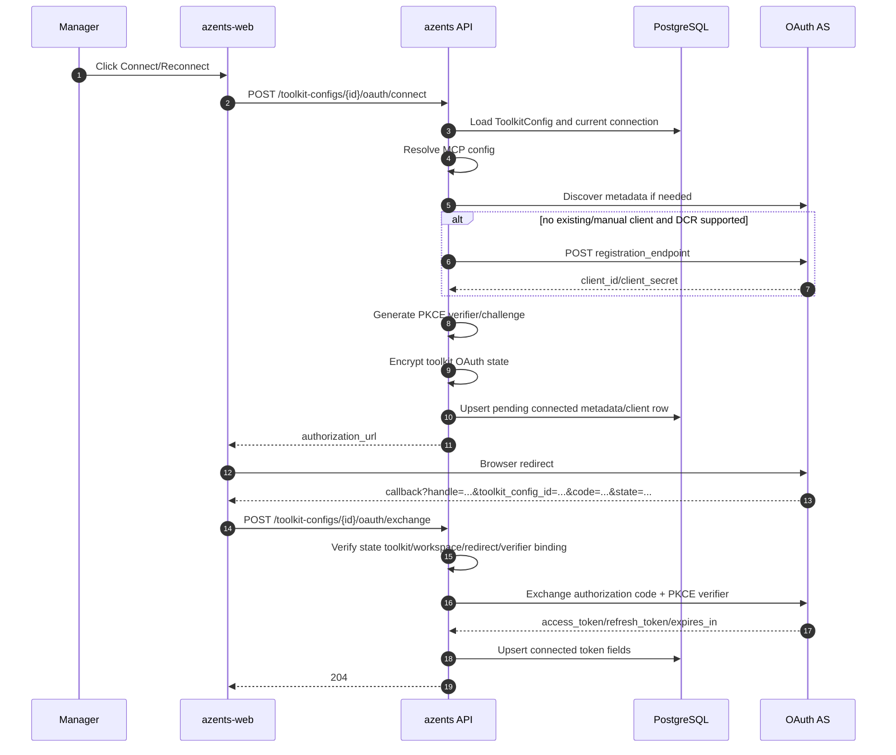

# MCP OAuth Flow

## Overview

MCP OAuth is a **toolkit-level** OAuth connection flow. A workspace manager connects OAuth once for a `ToolkitConfig`; every run that mounts that toolkit uses the same OAuth connection. This replaces the removed per-user MCP OAuth flow.

Supported toolkit types:

- generic `mcp` with `config.auth_type = "oauth2"`
- `notion`, which resolves internally to fixed Notion MCP URL + `auth_type="oauth2"`
- `sentry`, which resolves internally to fixed Sentry MCP URL + `auth_type="oauth2"`

The flow supports OAuth authorization code + PKCE S256, RFC 8414 metadata discovery, RFC 7591 Dynamic Client Registration, and RFC 8707 resource indicators.

## Invariants

- `oauth2_per_user` is not a valid current MCP auth type.
- OAuth grants are owned by `ToolkitConfig`, not by individual users.
- Existing per-user tokens are not promoted to toolkit-level grants.
- Access tokens, refresh tokens, client IDs, and client secrets are encrypted with `CredentialCipher` before DB storage.
- Runtime refresh is lazy and row-locked to protect refresh token rotation.
- A refresh failure with `invalid_grant` marks the connection `reconnect_required`.

## Preconditions

- `ToolkitConfig` exists in a workspace and is accessible to a manager.
- MCP config resolves to `auth_type="oauth2"`.
- OAuth metadata can be discovered, or both `auth_url` and `token_url` are configured.
- Either an existing OAuth connection/client registration exists, manager-provided OAuth client credentials exist in `ToolkitConfig.encrypted_credentials`, or the authorization server supports DCR.
- `AZ_CREDENTIAL_ENCRYPTION_KEY` is configured.
- Frontend callback URL is `web_url + "/oauth/mcp/callback?handle={handle}&toolkit_config_id={toolkit_id}"` for the active connection flow.

## Data Model

`mcp_oauth_connections` stores one connection per toolkit.

| Field | Meaning |
| --- | --- |
| `toolkit_id` | Unique FK to `toolkit_configs.id`; cascade delete |
| `issuer` | OAuth issuer when known |
| `resource` | RFC 8707 resource, normally the MCP server URL |
| `server_url` | MCP server URL used at connection time |
| `authorization_endpoint` | OAuth authorize endpoint |
| `token_endpoint` | OAuth token endpoint |
| `registration_endpoint` | DCR endpoint when present |
| `encrypted_client_id` | Encrypted OAuth client ID |
| `encrypted_client_secret` | Encrypted OAuth client secret, nullable for public clients |
| `token_endpoint_auth_method` | Current values: `client_secret_post` or `none` |
| `scope` | Space-delimited scope string |
| `encrypted_access_token` | Encrypted access token |
| `encrypted_refresh_token` | Encrypted refresh token |
| `expires_at` | Access-token expiration |
| `status` | `connected` or `reconnect_required` |

Removed per-user tables:

- `mcp_oauth2_tokens`
- `mcp_auth_requests`

## Manager Connection Flow



## Runtime Flow

```mermaid
sequenceDiagram
    autonumber
    participant Runtime
    participant DB as PostgreSQL
    participant AS as OAuth AS
    participant MCP as MCP Server

    Runtime->>DB: Load mcp_oauth_connections by toolkit_id
    alt missing or reconnect_required
        Runtime-->>Runtime: Bind no token; toolkit shows connection failure/setup prompt
    else token near expiry
        Runtime->>DB: SELECT connection FOR UPDATE
        Runtime->>AS: refresh_token grant
        AS-->>Runtime: new token set
        Runtime->>DB: Update encrypted tokens
    end
    Runtime-->>Runtime: update_context reads latest successful tool snapshot without waiting for list_tools
    Runtime->>MCP: background list_tools refresh with Bearer token
    Runtime->>DB: atomically replace successful deterministic tool snapshot
    Runtime->>MCP: call_tool with Bearer token
    alt call_tool returns 401
        Runtime->>DB: SELECT connection FOR UPDATE
        Runtime->>AS: force refresh
        AS-->>Runtime: new token set
        Runtime->>DB: Update encrypted tokens
        Runtime->>MCP: retry call_tool once
    end
```

## API

### Connect

`POST /toolkit/v1/workspaces/{handle}/toolkit-configs/{toolkit_config_id}/oauth/connect`

Requires `TOOLKITS_WRITE`. Returns:

```json
{ "authorization_url": "https://provider.example/authorize?..." }
```

### Exchange

`POST /toolkit/v1/workspaces/{handle}/toolkit-configs/{toolkit_config_id}/oauth/exchange`

Requires `TOOLKITS_WRITE`. Request:

```json
{ "code": "authorization-code", "state": "encrypted-state" }
```

Returns `204 No Content`.

### Disconnect

`DELETE /toolkit/v1/workspaces/{handle}/toolkit-configs/{toolkit_config_id}/oauth/connection`

Requires `TOOLKITS_WRITE`. Deletes the local OAuth connection row and returns `204 No Content`.

### Toolkit config response

Toolkit config responses include `oauth_connection` when a toolkit has a connection row:

```json
{
  "oauth_connection": {
    "status": "connected",
    "issuer": "https://example.com",
    "resource": "https://example.com/mcp",
    "scope": "read write",
    "expires_at": "2026-06-23T12:00:00Z"
  }
}
```

## Error Cases

| Error | Cause | Response / state | Recovery |
| --- | --- | --- | --- |
| Invalid auth type | Toolkit does not resolve to `auth_type=oauth2` | 400 | Manager selects OAuth2 or uses another auth mode |
| Discovery failed | Metadata unavailable and endpoints not configured | 400 | Manager configures `auth_url` and `token_url` |
| DCR unavailable | No client credentials and no `registration_endpoint` | 400 | Manager provides OAuth client credentials |
| Invalid state | Tampered callback or wrong toolkit/workspace | 400 | Restart connect |
| Token exchange rejected | Provider returns 4xx or OAuth error | 422 | Restart connect or fix provider setup |
| Missing connection | Exchange without prior connect | 404 | Restart connect |
| Refresh invalid_grant | Provider revoked or rotated away refresh token | `reconnect_required` | Manager reconnects |
| 401 after retry | Refresh failed or token still rejected | Tool call returns MCP auth error | Manager reconnects or fixes provider scopes |

Runtime `list_tools` failure is not a run-startup failure. If a previous successful snapshot exists,
the old snapshot remains model-visible. If no snapshot exists, no MCP tools are exposed and no MCP
loading/error prompt or retry pseudo-tool is added to the model-visible surface.

## Cryptography

| Mechanism | Target | Purpose |
| --- | --- | --- |
| AES-GCM state encryption | `{toolkit_id, workspace_id, user_id, redirect_uri, code_verifier, nonce}` | Callback integrity and PKCE verifier storage |
| PKCE S256 | Authorization code flow | Authorization code interception protection |
| Fernet via `CredentialCipher` | DB client/token fields | Protect OAuth credentials at rest |
| RFC 8707 resource | Authorization/token request | Bind issued token to MCP resource |

## UI Behavior

Toolkit edit pages show OAuth connection state for `mcp` with `auth_type=oauth2`, `notion`, and `sentry`.

Displayed fields:

- status: `not_connected`, `connected`, or `reconnect_required`
- issuer
- resource
- scope
- expiration
- connect/reconnect/disconnect actions

The UI does not display account identity and does not add warning copy.

## Changelog

- **2026-06-23** (spec_version 3) — Replaced per-user OAuth spec with toolkit-level OAuth connections. Current code: `mcp_oauth_connections`, connect/exchange/disconnect APIs, toolkit response summary, lazy row-locked refresh, Notion/Sentry `auth_type=oauth2`, and per-user table/API/runtime removal.
- **2026-04-20** (spec_version 1) — Initial per-user OAuth spec.
