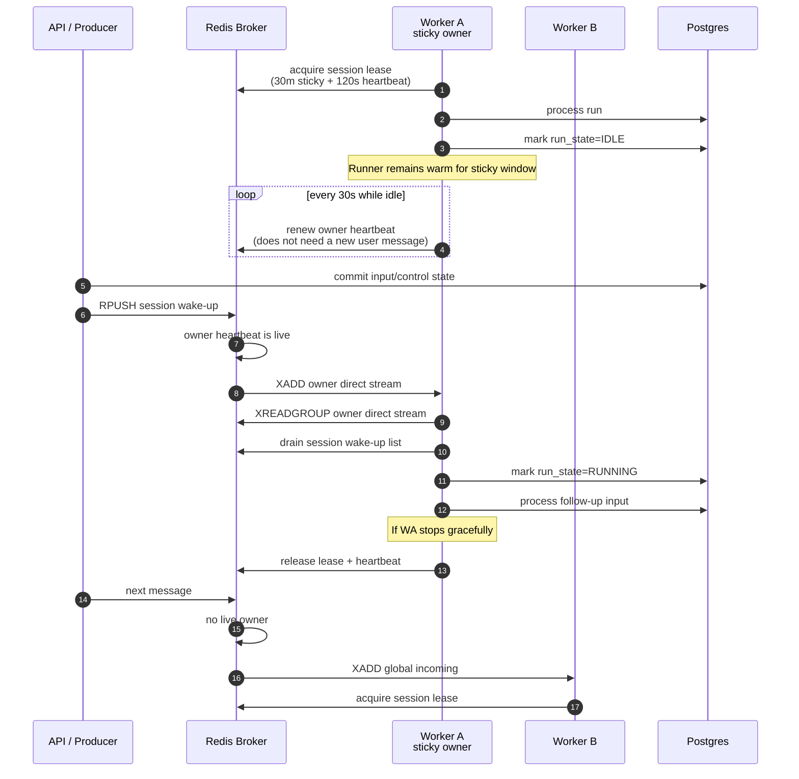
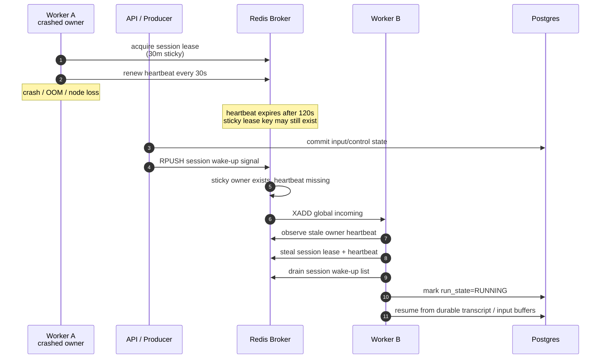

# Run Resume

Run resume handles worker shutdown, process crash, stale running state, and interrupted tool calls.
The event runtime resumes from durable transcript and `agent_runs`, not SDK serialized
`RunState`.

## Resume Sources

| Source | Detection | Behavior |
| --- | --- | --- |
| Broker wake-up | New session wake-up signal | Live sticky owner receives the wake-up directly; otherwise a worker can take over after owner heartbeat expiry |
| Broker redelivery | Unacked session wake-up signal | Another worker receives and resumes from durable DB state |
| Stale session activity | Worker recovery scan of `agent_sessions.run_state` | Worker enqueues a wake-up signal for the affected session |
| Active event run | pending/running `agent_runs`, resolved inference provenance, phase, active tools, and retry state | Runtime preserves the run/input boundary, resumes from an activated snapshot, and repairs missing interrupted results |
| Pending tool call | Event transcript has call without result | Runtime executes or interrupts the missing result path without duplicating completed results |
| Pending operation action | Session has a nonterminal buffer-keyed action execution | Worker resumes it from the durable action payload; terminal failure is not retried and does not permanently block later FIFO input. |

## Ownership Lease

Session ownership is a sticky worker lease. It is separate from `AgentSession.run_state` and exists
to keep follow-up inputs on the same warm `_SessionRunner` and session-scoped toolkit lifecycle.

| Concept | Authority | Duration | Purpose |
| --- | --- | --- | --- |
| Sticky ownership lease | Redis session owner key | 30 minutes of session idle time | Route follow-up inputs to the same worker and preserve warm session toolkit lifecycle |
| Owner heartbeat | Redis owner heartbeat key | 120 seconds | Prove that the sticky owner worker is still alive |
| Heartbeat interval | Worker idle loop | 30 seconds | Refresh owner heartbeat while the runner is idle but still owns the session |
| Graceful release | Worker shutdown / runner teardown | Immediate | Return ownership when the worker intentionally stops owning the session |

The sticky lease and heartbeat timeout intentionally have different meanings:

- The 30-minute lease is the normal owner stickiness window.
- The 120-second heartbeat timeout is a failure detector. If the heartbeat is stale, another worker
  may revoke the owner even if the 30-minute sticky lease has not expired.
- A graceful shutdown must release both the owner lease and owner heartbeat immediately.

## Worker State And Routing

`AgentSession.run_state` remains a coarse session execution recovery signal (`idle` / `running`).
Detailed execution state lives in `agent_runs.phase`, `active_tool_calls`, and nullable
`retry_state`. `AgentRuntime` owns shared sandbox lifecycle and runner/provider state, not session
run ownership.

Worker shutdown must not partially process a new message. If shutdown wins before processing, the
message is left for broker redelivery or ownership takeover.

If shutdown is observed while a foreground run is active, the run boundary is a worker handover
boundary, not an idle boundary. The current worker may wait briefly for `engine.run()` to finish
cleanly, but even a clean return during shutdown must skip idle hooks, skip Goal continuation
creation, and skip `AgentSession.run_state=IDLE`. The worker releases the ownership lease and heartbeat; a new
worker resumes from the durable transcript, `agent_runs`, pending input buffers, and session
wake-up state.

Broker wake-up routing uses the ownership lease:

1. A producer commits model input or control state to Postgres, then stores a wake-up signal in the
   per-session wake-up list.
2. If the session has a live owner heartbeat, the producer publishes the wake-up to the owner
   worker's direct stream.
3. If there is no live owner heartbeat, the producer publishes to the global incoming stream.
4. A non-owner worker that observes a global wake-up for a live owner does not process the message.
   It forwards the wake-up to the owner worker's direct stream.
5. If the sticky owner key exists but the owner heartbeat has been missing for 120 seconds, the
   observing worker may take over the session lease and process queued wake-ups.

Redis Cluster imposes two routing constraints on the broker implementation:

- Owner lease scripts only touch keys that share the session hash tag, for example
  `azents:session:{session_id}:lock` and `azents:session:{session_id}:owner-heartbeat`.
- Workers read the global incoming stream and their worker direct stream with separate
  `XREADGROUP` commands. They must not pass both stream keys to one Redis command because those
  streams can live in different cluster hash slots.

## Failure And Takeover

When a worker crashes, the sticky lease key can outlive the process. The owner heartbeat is the
failure detector:

The takeover path must preserve single-session execution:

- A live owner heartbeat prevents non-owner processing.
- A stale heartbeat permits lease stealing even if the 30-minute sticky key remains.
- Wake-up signals remain in the per-session Redis list until a worker with valid ownership drains
  them. Model input payloads, operation action inputs, and control state remain durable in Postgres. Before an operation input buffer is deleted, its pending `ActionExecution` and typed action payload are committed under the source `input_buffer_id`; takeover resumes nonterminal execution from that durable claim.
- Durable transcript and `agent_runs` remain the execution source of truth after takeover.

## Operation Action Recovery

Operation TurnActions enter through durable `action_message` InputBuffers, but they do not append an
`action_message` transcript event. Preparation claims a worktree action by committing an
`ActionExecution` keyed by `input_buffer_id` with its typed action payload, then deletes the source
buffer in the same transaction. Takeover resumes any nonterminal execution from this durable claim;
a completed action is not duplicated. A failed action is terminal, is not retried or discarded, and
FIFO processing may continue to later pending input. Running workers process TurnActions at model-call
turn boundaries instead of waiting for run completion. If a Project-mutating action completes, the
same active run rebuilds model/tool context before its next model call. Completed and failed worktree
projections are appended to durable history as `action_execution_result` events, and terminal live
action state is not kept as a persistent fallback.

## Failed-run Retry Recovery

When a running `agent_runs` row has non-null `retry_state`, that state is the durable retry resume
source. Recovery and handover must preserve the failed attempt count and `next_retry_at`; a worker
restart must not reset the retry budget or bypass exponential backoff. If a terminal transition closes
the run, terminal helpers clear `retry_state` so stale retry state cannot be resumed.

A worker that acquires a session during retry must treat the run as still active. It may re-enter the
same run boundary with the existing `run_id`; the adapter must reuse the existing `agent_runs` row
instead of creating a replacement row. Retry wait may be resumed from `next_retry_at`, and stop while
waiting finalizes the failed run with `finalization_reason = retry_stopped_by_user`. Shutdown while
waiting leaves the run `running` for the next worker instead of writing durable failed history.

## Inference Profile Recovery

Pending and running `AgentRun` rows are active recovery sources. Recovery claims the existing run and its ordered input-event associations rather than creating a new run boundary. The Session current inference snapshot is the turn execution authority: it contains requested label, resolved physical selection, effort, effective limits, and resolution time. Recovery must not overwrite it from older run-owned provenance. A pending normal input resolves during preparation; successful preparation atomically updates the Session snapshot with canonical events and buffer deletion. A handled resolution failure preserves the previous snapshot, appends a deterministic user-safe error, consumes the failed head, and completes the active run without retry. A later profile change within a running run updates the Session snapshot for the next turn and rebuilds that same run's request.

Manual failed-run retry is a distinct new pending run. It copies the original requested profile and ordered input associations, marks source `retry_original`, and leaves resolved provenance empty so current Agent routing is resolved once at activation. The first child subagent run is different: it is precreated with a parent run id and a complete resolved snapshot, effort, and limits. It uses source `parent_run` for exact inheritance or `spawn_override` for a statically resolved non-full-history override. Recovery activates either pre-resolved source without re-routing the requested label, so first-run execution does not depend on whether the original target label still exists. Later child runs resolve the stored session-last-used label normally.

## Tool Recovery

If a foreground tool call has no corresponding result after interruption, the runtime appends a
synthetic `client_tool_result(status=interrupted)` and then appends a terminal run marker. Completed
tool results are never re-executed.

## User Stop Resume Boundary

User-requested stop is a terminal interruption, not a sticky stop condition for future turns. The
stop finalizer consumes the durable stop request, records user stop events, and clears
`AgentSession.stop_requested_at` before the next wake-up can process buffered input. The durable
event order for a stopped run is:

1. Any live assistant/reasoning projection that can be persisted.
2. Missing foreground tool results repaired as cancelled/interrupted tool results.
3. `interrupted` with `reason=user_requested`.
4. `run_marker(status=interrupted)`.

If an input buffer is already pending when stop handling finishes, the warm session runner must
enqueue or preserve a wake-up so the next run starts immediately. A stale stop request must not cause
that next run to observe `check_stop()` as true.

## Invariants

- Durable transcript, ordered run-input associations, and pending/running `agent_runs` are the resume source of truth.
- The Session inference snapshot is complete and atomic per turn; recovery never restores it from an older AgentRun snapshot.
- `agent_runs.retry_state` is the resume source for failed-run retry progress while a run remains running.
- A live sticky owner must receive follow-up broker wake-ups directly.
- A non-owner worker must not process a session while the owner heartbeat is live.
- A stale owner heartbeat revokes the sticky owner even if the 30-minute lease key has not expired.
- In-memory worker state is not required after crash because takeover resumes from durable state.
- Shutdown/handover run completion is not quiescent idle and must not dispatch idle continuation
  hooks.
- Completed tool results are not duplicated.
- User stop intent is consumed by stop finalization and must not interrupt the next wake-up.
- Nonterminal operation execution resumes from its buffer-keyed durable action payload; terminal failure is never retried.
- SDK `RunState` compatibility is not preserved.

## Changelog

- **2026-07-12** (spec_version 17) — Promoted Session-owned per-turn inference recovery, handled preparation failure, buffer-only action transport, buffer-keyed action recovery, and same-run context rebuild.
- **2026-07-11** (spec_version 16) — Added recovery semantics for pre-resolved `spawn_override` child runs and later session-last-used re-resolution.
- **2026-07-10** (spec_version 15) — Added pending/activated profile recovery, retry intent re-resolution, and exact inherited parent-run snapshot recovery.
- **2026-07-08** (spec_version 14) — Clarified that failed TurnActions continue FIFO processing and context invalidation uses a cancelled run boundary plus follow-up wake-up, not a completed run marker.
- **2026-07-08** (spec_version 13) — Clarified that running workers process TurnActions at model-call turn boundaries and hand off after context invalidation.
- **2026-07-06** (spec_version 12) — Removed session-initialization recovery and documented durable terminal action result recovery.
- **2026-07-05** (spec_version 11) — Added operation TurnAction recovery semantics for action-based Git worktree setup.
