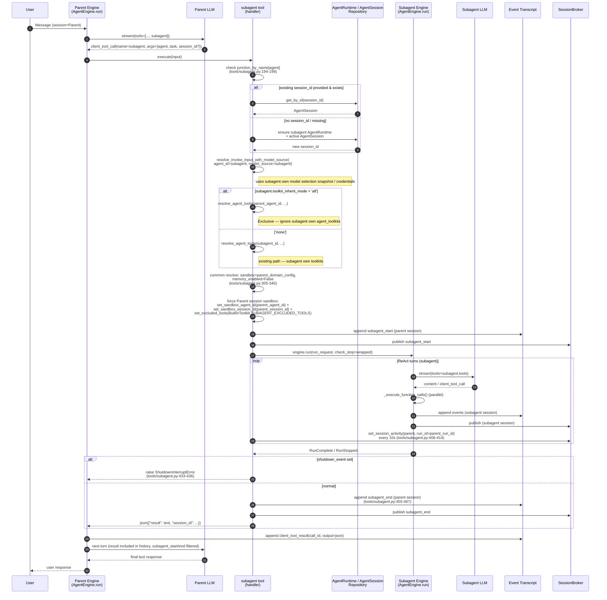

# Subagent Delegation Flow

This flow describes how a parent agent calls the `subagent` tool to delegate work to a specialized subagent, then merges the result back into its own conversation history. This document is **behavior-centered** and describes how runtime code actually behaves with code-line-oriented references.

The broad Agent domain (storage structure, permissions, lifecycle, etc.) is covered in [`spec/domain/agent.md`](../domain/agent.md). This document focuses on the exact runtime sequence of "parent → subagent → parent" one-hop delegation.

## 1. Overview

### 1.1 Purpose

Subagent composition is a pattern where a parent agent calls **another agent** specialized for a role like a tool and delegates work. Delegated subagent runs an independent ReAct loop with its own LLM provider, toolkit, and system prompt, then returns result string to parent. Parent agent merges that string as output of `subagent` tool_call in the immediately following turn and produces its response.

### 1.2 Scope

- **Included**: execution path from moment parent agent selects and calls `subagent` tool until `subagent engine.run()` completes and result is appended to parent history.
- **Excluded**: subagent junction CRUD (agent domain spec), builtin tool decision logic (`spec/domain/toolkit.md`), ReAct loop internals (`spec/domain/agent.md` §3.1).

### 1.3 Key design decisions

- **Subagent = single integrated tool** — even if multiple subagents are connected, LLM sees one `subagent` tool and selects target via `agent` argument ([`tools/subagent.py:153-170`](../../../python/apps/azents/src/azents/engine/tools/subagent.py)).
- **1-hop cycle blocked** — DB-level CHECK constraint `ck_agent_subagents_no_self_ref` on `agent_subagents` prevents self-loop where `agent_id = subagent_id`. Multi-step cycle (A→B→A) is **not blocked** — it relies on operational role separation (`role=AGENT` vs `role=SUBAGENT`) and the fact that parent synchronously calls subagent. See `[parent-child-no-self-ref]` in [`spec/domain/agent.md` §4](../domain/agent.md).
- **Share parent AgentSession sandbox** — after 2026-04-24 per-session sandbox cutover (ADR-0001), subagent reuses parent **session** sandbox. Subagent tool handler binds builtin toolkit sandbox scope to parent session with `set_sandbox_agent_id(parent_agent_id)` + `set_sandbox_session_id(parent_session_id)` (avoids cold start and lock contention). Tools that can destroy parent environment such as `shell_recreate_sandbox` are excluded with `_EXCLUDED_TOOL_NAMES` ([`tools/subagent.py:320-329`](../../../python/apps/azents/src/azents/engine/tools/subagent.py)).
- **Current parent run context binding** — parent `subagent` tool is exposed through session-scoped toolkit wrapper, but actual unified tool handler is created every turn from `TurnContext`. Therefore parent `run_id`, `publish_event`, `check_stop`, and current actor use active run values and never reuse previous run values.
- **AgentRuntime / AgentSession based execution** — Subagent uses target subagent's `AgentRuntime` and active `AgentSession`. There is no legacy `ConversationSession` parent row / `parent_session_id`. Only result is delivered to parent, while subagent detailed turns are stored independently in subagent `AgentSession`.
- **Model snapshot / Toolkit Inherit** — subagent has its own main/lightweight model selection snapshot. Parent model runtime inheritance was removed. Toolkit inherit remains at agent row level (`agents.toolkit_inherit_mode ∈ {'none','all'}`). Detailed rationale is in [`adr/0063-agent-model-selection-snapshot.md`](../../adr/0063-agent-model-selection-snapshot.md), and toolkit rules are in [`spec/domain/toolkit.md` "Main-Only Toolkit" / "Toolkit Inherit (Subagent)" sections](../domain/toolkit.md).

## 2. User Scenario

User: "Analyze the cause of last week's slow queries in our workspace prod DB."

1. User sends request to main agent (Parent, `role=AGENT`).
2. Parent sees `db-analyst` subagent in "Available agents" list of system prompt and creates `subagent(agent="db-analyst", task="…")` tool_call.
3. Engine synchronously executes `subagent` tool handler while keeping Parent run alive. It ensures subagent active `AgentSession` and runs `AgentEngine.run()` with subagent's independent LLM + toolkit.
4. Subagent performs query → aggregate → analyze in its own loop and creates final text response (including URI if there is file).
5. On subagent completion, engine appends result as `subagent_end` durable event to parent session and merges `subagent` tool return string (`{"result": ..., "session_id": ...}`) into tool output.
6. Parent LLM reads this string in next turn and responds to user. If called again with same `session_id`, subagent session continues.

## 3. Preconditions

- **Parent agent has `role=AGENT`**, and DB `agent_subagents` has parent `agent_id` → child `subagent_id` junction (`enabled=true`) ([`rdb/models/agent_subagent.py:27-38`](../../../python/apps/azents/src/azents/rdb/models/agent_subagent.py)).
- **Subagent agent has `role=SUBAGENT`** and has system prompt, own `model_selection` / `lightweight_model_selection`, optional toolkit bindings. There is no parent model runtime inheritance; UX that follows parent model is handled by snapshot copy at create/update time. `shell_enabled` controls whether subagent shell is exposed.
- **`subagent` tool is injected into tool_map only while Worker picked up Parent session**. Worker engine filters only active junctions with `resolve_subagent_tools()` at each run start and builds `SubagentToolContext` ([`worker/worker.py:905-945`](../../../python/apps/azents/src/azents/worker/worker.py), [`engine/run/resolve.py:587-633`](../../../python/apps/azents/src/azents/engine/run/resolve.py)).
- **Sandbox domain policy** — parent's `SandboxDomainConfig` is already calculated and transparently injected as `parent_domain_config` when executing subagent. Subagent does not resolve separate domain policy again.
- **Subagent and parent are in same workspace** — current implementation runs subagent with subagent workspace in `resolve_invoke_input`, but junction creation rejects cross-workspace with `CrossWorkspace` error ([`services/agent_subagent/data.py:70-75`](../../../python/apps/azents/src/azents/services/agent_subagent/data.py)).

## 4. Sequence

Diagram below shows **entire process where subagent tool is called in one parent turn**. Line numbers in parentheses refer to [`engine/tools/subagent.py`](../../../python/apps/azents/src/azents/engine/tools/subagent.py).

**Step count**: sequence is User message → tool_call → session creation → model snapshot resolve → toolkit source branch → sandbox/excluded tool application → subagent_start → subagent loop → shutdown branch → subagent_end → parent history merge → final response. Toolkit inherit branch is determined by reading both junction and subagent agent row values.

Additional consistency rules:

- `subagent_start` / `subagent_end` are durably stored in parent DB, but `convert_to_llm_messages` drops them from LLM input. LLM sees only `client_tool_result.output` JSON.
- Subagent `check_stop` is OR-combined with parent `check_stop`, so if parent is stopped, subagent stops together ([`tools/subagent.py:350-355`](../../../python/apps/azents/src/azents/engine/tools/subagent.py)).
- Calls `broker.set_session_activity(parent_session_id, parent_run_id)` every 10 seconds to prevent parent session TTL expiration ([`tools/subagent.py:373-414`](../../../python/apps/azents/src/azents/engine/tools/subagent.py)).

## 5. Data Changes

### 5.1 AgentRuntime / AgentSession records

| Time | parent runtime/session | subagent runtime/session |
|---|---|---|
| Parent pickup | parent `AgentRuntime.run_state=RUNNING`, parent `AgentSession` active | ensure subagent `AgentRuntime` / active `AgentSession` if needed |
| Subagent start | unchanged, periodically touch parent activity | prepare to append events to subagent `AgentSession` |
| Subagent run | unchanged | because engine is directly called, subagent `AgentRuntime.run_state` is separate from worker pickup transition |
| Subagent complete | append `subagent_end` durable event | events appended to subagent `AgentSession`, session can later resume with `session_id` |

See [`rdb/models/agent_session.py`](../../../python/apps/azents/src/azents/rdb/models/agent_session.py) for `AgentSession` schema and [`rdb/models/agent_runtime.py`](../../../python/apps/azents/src/azents/rdb/models/agent_runtime.py) for `AgentRuntime` schema.

### 5.2 Event append

Both sessions store events through event transcript repository.

- **Parent session** — `subagent_start`, `subagent_end`, and parent's own `client_tool_call` / `client_tool_result`. Start/End are durable markers for UI progress display.
- **Subagent session** — all turn events of subagent. They are not delivered to parent. Event runtime append path stores durably and broker publish emits to subagent session channel so UI can view subagent trace separately ([`tools/subagent.py:379-402`](../../../python/apps/azents/src/azents/engine/tools/subagent.py)).

### 5.3 File storage

Override `storage_session_id`, `storage_agent_id`, `storage_path_prefix` to parent side ([`tools/subagent.py:338-345`](../../../python/apps/azents/src/azents/engine/tools/subagent.py)). Files written by subagent are stored in **parent session artifact** with `subagent-{subagent_session_id}/` prefix so parent can access them with `read` / `present_file`.

### 5.4 Memory scope

- **Subagent resolves tools with `memory_enabled=False`** ([`tools/subagent.py:317`](../../../python/apps/azents/src/azents/engine/tools/subagent.py)). Thus even if builtin shell toolkit is exposed to subagent, `memory_prompt` injection is empty, guiding LLM at prompt level not to actively use memory.
- **No tool-level write block yet** — if subagent intentionally tries to write to `shared:///agent/memories/`, it is not physically blocked. Related issue: [`issues/subagent-memory-write-restriction.md`](../../issues/subagent-memory-write-restriction.md).
- **Shared scope drift** — `shared:///agent/` currently maps to subagent's own `agent_id`. To access parent memory/skills, `shared:///agent/` must be remapped to parent agent scope (issue: [`issues/subagent-shared-scope-routing.md`](../../issues/subagent-shared-scope-routing.md)).

### 5.5 Model snapshot / Toolkit source

Model source is always subagent's own Agent row. There is no parent model runtime inheritance. Only toolkit source branches by `toolkit_inherit_mode`.

| Source | Decision input | source = subagent itself | source = parent |
|---|---|---|---|
| LLM main/lightweight selection + Integration | fixed | always subagent `model_selection` / `lightweight_model_selection` | — |
| DB-registered toolkit bundle | `agents.toolkit_inherit_mode` | `'none'` — `resolve_agent_tools(subagent_id)` | `'all'` (default) — `resolve_agent_tools(parent_agent_id)` |
| `system_prompt`, `model_parameters`, `workspace_id` | fixed | always based on subagent row | — |
| `BuiltinToolkit` (shell/read/write, etc.) | subagent `shell_enabled`, forced `memory_enabled=False` | always based on subagent | — |
| Worker dynamic inject (`subagent`, `background_task`, `schedule`) | worker engine injection presence | not injected in subagent resolve path | — |

Code references: model snapshot resolve [`engine/tools/subagent.py`](../../../python/apps/azents/src/azents/engine/tools/subagent.py), toolkit branch and main-only filter [`engine/tools/subagent.py`](../../../python/apps/azents/src/azents/engine/tools/subagent.py), resolve helper [`engine/run/resolve.py`](../../../python/apps/azents/src/azents/engine/run/resolve.py).

**Exclusive inherit** — when `toolkit_inherit_mode='all'`, subagent's own `agent_toolkits` junction is **completely ignored** (no merge / dedupe). Even if subagent has separately attached toolkits, they are invisible in this junction call path. Its own toolkit appears only if same subagent is attached to another parent with `mode='none'` (DP6, see design document).

## 6. Error Cases

| Condition | Detection point | Result |
|---|---|---|
| `agent` argument not in enum | beginning of `handler()`, `junction_by_name.get()` | `FunctionToolError("Unknown agent: …")` — enters parent tool output as error string. Loop continues ([`tools/subagent.py:194-199`](../../../python/apps/azents/src/azents/engine/tools/subagent.py)) |
| provided `session_id` but subagent session does not exist | `get_by_id()` returns `None` | warn log then **create new session and continue**. Result same as success path ([`tools/subagent.py:211-234`](../../../python/apps/azents/src/azents/engine/tools/subagent.py)) |
| Subagent resolve failure (disabled, etc.) | `resolve_invoke_input()` → `Failure` | `FunctionToolError("Failed to resolve subagent: …")` — error in parent tool output ([`tools/subagent.py:272-273`](../../../python/apps/azents/src/azents/engine/tools/subagent.py)) |
| Self-reference (`agent_id == subagent_id`) | DB `ck_agent_subagents_no_self_ref` | junction INSERT fails with `IntegrityError` — blocked before runtime (rule `[parent-child-no-self-ref]`) |
| Multi-step cycle (A→B→A) | **not implemented** | currently prevented by whether subagent tool is exposed. Relies on operational rule that subagent agent cannot have its own subagents (`spec/domain/agent.md` drift note) |
| Exception while subagent engine runs | `except Exception` around `async for item in engine.run(...)` | log + `result_texts.append("Error: An unexpected error occurred while running subagent …")`. Joins normal completion path and parent receives error text as output ([`tools/subagent.py:415-426`](../../../python/apps/azents/src/azents/engine/tools/subagent.py)) |
| Worker shutdown detected | after async for exits, `shutdown_event.is_set()` | propagate `ShutdownInterruptError` → no `client_tool_result` appended to parent (no result row matching call_id) → pending tool resume path continues after restart ([`tools/subagent.py:432-436`](../../../python/apps/azents/src/azents/engine/tools/subagent.py)) |
| Parent stop triggered | `subagent_check_stop()` returns True | subagent engine ends with `RunStopped`, propagated to parent |
| No subagent output and no files | both `result_texts`, `result_attachments` empty | return `"(no output)"`; prevents tool output from becoming empty string ([`tools/subagent.py:452-453`](../../../python/apps/azents/src/azents/engine/tools/subagent.py)) |
| Subagent tries `shell_recreate_sandbox` | excluded by `MAIN_ONLY_TOOL_NAMES` (previous name `_EXCLUDED_TOOL_NAMES`) at tool-name level | tool absent from tool_map, so LLM cannot select it ([`tools/subagent.py:74`](../../../python/apps/azents/src/azents/engine/tools/subagent.py)) |
| Subagent attempts parent memory path write | **no defense (known issue)** | physically succeeds but violates prompt-guided contract. Tracked as issue |
| Subagent model selection snapshot missing | DB constraint / migration backfill | current schema requires every Agent snapshot, so unreachable on normal path |
| `toolkit_inherit_mode='all'` but parent has zero DB-registered toolkits | `resolve_agent_tools(parent_id)` returns empty list | no error. Subagent runs only with auto-bound toolkit (builtin shell, etc.). UX may be odd but runtime does not fail |
| Parent main-only toolkit included in inherit target | excluded by BuiltinToolkit own `SUBAGENT_EXCLUDED_TOOLS` (DP4 C) | tool not exposed to LLM. Not an error |

## 7. Test Scenarios

This section defines minimum coverage for future E2E / integration tests. Current unit level verifies parent/subagent activity integration in `engine/run/background_test.py`; subagent-specific tool test is partially covered in `engine_test.py` because full flow is hard to mock.

### 7.1 Seed

- Workspace W, Parent agent P (`role=AGENT`, model selection snapshot + toolkit config), Subagent agent S (`role=SUBAGENT`, own model selection snapshot).
- `AgentSubagent(parent=P, subagent=S, description="DB analyst", enabled=true)`.
- User U is workspace member who can open session for P.

### 7.2 TC — successful delegation

1. U asks P to "call S and perform X".
2. P calls `subagent(agent="S", task="X")`.
3. Verify:
   - Subagent active `AgentSession` is ensured.
   - `subagent_start`, `subagent_end` durable events are appended to Parent session.
   - Parent `client_tool_result.output` is JSON string `{"result": "...", "session_id": "..."}` (paired with same `call_id` `client_tool_call`).
   - P final response text reflects summary of subagent result.

### 7.3 TC — reject self-reference cycle

1. Try creating `AgentSubagent(agent_id=P.id, subagent_id=P.id)` through API.
2. Verify: DB `IntegrityError` occurs and API fails with 4xx. Runtime path is never reached.

### 7.4 TC — nonexistent subagent name

1. Model calls with incorrectly learned name `"nonexistent"` in `agent` argument.
2. Verify: Parent `client_tool_result.output` contains error string like `"Unknown agent: nonexistent. Available agents: S"`. Parent engine proceeds to next turn without exception. Subagent session is not created.

### 7.5 TC — Session resume

1. After TC 7.2 succeeds, P again calls `subagent(agent="S", session_id=<previous subagent session>)` in same conversation.
2. Verify: No new session is created and events keep appending to existing subagent session. Same `session_id` appears again in result JSON.

### 7.6 TC — Memory write attempt (prompt enforcement)

1. S system prompt lacks guidance "do not write memory".
2. Model tries writing to `shared:///agent/memories/note.md`.
3. Current expected behavior: **write succeeds** (no forced block). This TC will be changed to expect "denied" after issue `subagent-memory-write-restriction` is fixed. Currently recorded as **known gap**.

### 7.7 TC — Toolkit inherit (`mode='all'`)

1. Attach only `github` toolkit to Parent P; Subagent S has no toolkit.
2. Create junction `AgentSubagent(P, S, toolkit_inherit_mode='all')`.
3. Ask P to "call S and investigate GitHub".
4. Verify: subagent run tool list includes `github_*` tools. Even if S has own additional `agent_toolkits`, they are ignored in that run (exclusive). BuiltinToolkit own excluded tools applied (DP4 C).

### 7.8 TC — Subagent own model snapshot

1. Create Parent P with Opus model snapshot and Subagent S with Sonnet model snapshot.
2. Call S as subagent tool from P.
3. Verify: subagent engine runs with S's Sonnet snapshot and credentials (check model identifier in subagent event). P's model snapshot is not inherited at runtime.

### 7.9 TC — interrupted during shutdown

1. Send worker SIGTERM while P's subagent call is in progress.
2. Verify: parent tool execution is interrupted by `ShutdownInterruptError` and `client_tool_result` is not appended (no result row matching call_id). After restart, pending tool resume path (`spec/domain/agent.md` §3.1 step 5) reexecutes subagent tool. However, saved arguments do not contain `session_id`, so a new subagent session is created (§9 drift).

## 8. Related Issues & Design Notes

- [`issues/subagent-memory-write-restriction.md`](../../issues/subagent-memory-write-restriction.md) — no tool-level method to block subagent memory write.
- [`issues/subagent-shared-scope-routing.md`](../../issues/subagent-shared-scope-routing.md) — `shared:///agent/` maps to subagent itself, not parent. Affects §5.4 of this flow.
- [`design/subagent.md`](../../design/subagent.md) — decision adopting integrated `subagent` tool + `agent` argument routing.
- [`spec/domain/agent.md`](../domain/agent.md) — broad Agent domain and subagent model snapshot / toolkit inherit rules.

## 9. Drift Notes

Mismatches/improvement candidates discovered when writing this spec:

- **Multi-step cycle not blocked** — there is no runtime/DB logic preventing `A → B → A`. It relies on implicit operational rule that `role=SUBAGENT` cannot have own subagents. Even after Toolkit inherit, `subagent` toolkit is worker dynamic inject and not in DB junction, so it remains structurally not inherited.
- **Shutdown resume idempotency** — pending FC resume creates a new subagent session instead of continuing existing one. Could be improved by storing `session_id` in tool arguments and reusing it on restore.
- **No runtime revalidation of cross-workspace** — junction creation blocks it, but runtime does not re-check if subagent workspace is moved later.
- **Subagent `shell_enabled` is not inherited** — even with `toolkit_inherit_mode='all'`, shell (builtin) exposure follows subagent's own `shell_enabled`. If parent uses shell but subagent has `shell_enabled=False`, subagent runs without shell. This is current intended behavior (see design document Feasibility note); revisit if new requirement appears.

## 10. Changelog

| Date | Version | Change | Rationale |
|---|---|---|---|
| 2026-06-16 | 12 | Updated to subagent own model snapshot + toolkit inherit structure after ModelConfig runtime inherit removal | [`adr/0063-agent-model-selection-snapshot.md`](../../adr/0063-agent-model-selection-snapshot.md) |
| 2026-04-20 | 1 | Initial creation (P8, issue #2792) | this PR |
| 2026-04-24 | 2 | Added §1.3 inherit option summary, two model/toolkit source branches in §4 Sequence, new §5.5 Inherit branch table, three error cases in §6 (InvalidModelPair / ParentModelUnavailable / main-only filter), TC 7.7-7.9 (issue #2967) | `design/subagent-inherit.md` |
| 2026-05-05 | 3 | Removed unsupported legacy external session type from Parent identity example and reduced possible parent identity to `WEB/AGENT` | #3384 |
| 2026-05-05 | 4 | Removed legacy `ConversationSession` parent row / `parent_session_id` based subagent execution and reflected subagent run uses `AgentRuntime` / `AgentSession` | this PR |
| 2026-05-06 | 5 | Removed File API isolation bypass model from subagent output storage explanation and reorganized as parent session artifact model | this PR |
| 2026-05-06 | 6 | Reverified that parent/session/runtime boundaries of subagent delegation remain after Agent File Exchange Storage change | [`design/agent-file-exchange-storage.md`](../../design/agent-file-exchange-storage.md) |
| 2026-05-17 | 7 | Updated subagent model inherit from nullable static provider-model pair to explicit `model_config_inherit_mode` + ModelConfig main/lightweight inherit | [`design/dynamic-llm-model-configs.md`](../../design/dynamic-llm-model-configs.md) |
| 2026-05-20 | 8 | Cleaned changelog wording to match terminology that `AgentSession` is not interface-specific session type | PR #3848 review |
