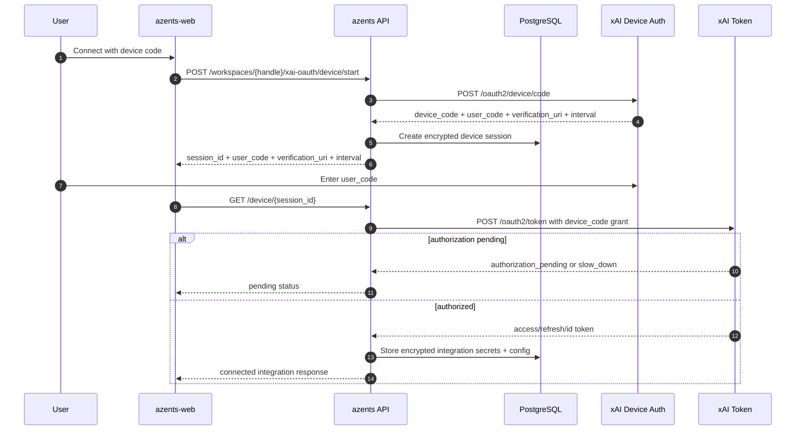
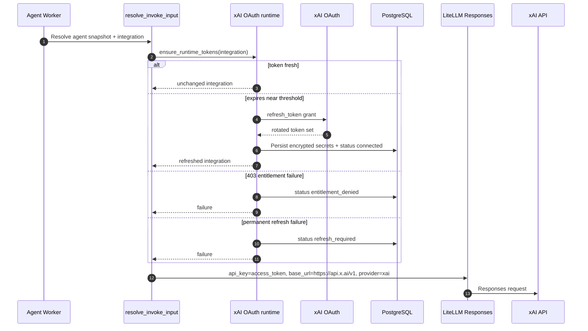

# xAI OAuth Flow

## Overview

xAI OAuth flow is an experimental provider connection flow that lets a workspace run agents with a user-authorized xAI account credential. Provider enum is `xai_oauth`, separate from the future xAI API key provider because subscription OAuth uses different billing, entitlement, setup, and refresh behavior.

The provider is disabled by default. It is available only when both server settings are configured:

- `AZ_XAI_OAUTH_ENABLED=true`
- `AZ_XAI_OAUTH_CLIENT_ID=<operator-owned OAuth client id>`

When unavailable, the provider capability list omits `xai_oauth`, the LLM Settings create modal hides the provider option, and direct xAI OAuth device start returns not found.

## Provider Constants

| Value | Current setting |
|---|---|
| issuer | `https://auth.x.ai` |
| discovery | `https://auth.x.ai/.well-known/openid-configuration` |
| device code | `https://auth.x.ai/oauth2/device/code` |
| token | `https://auth.x.ai/oauth2/token` |
| scope | `openid profile email offline_access api:access grok-cli:access` |
| runtime base URL | `https://api.x.ai/v1` |

The OAuth client id comes only from configuration. It is not hard-coded from another application.

## Data Model

`XaiOAuthSession` is intermediate state for device connection.

| Field | Meaning |
|---|---|
| `workspace_id`, `user_id` | session owner; must match current member on poll/cancel |
| `encrypted_device_code` | provider device code encrypted with the credential cipher |
| `user_code` | user input code displayed in device start response |
| `verification_uri` | provider verification URI displayed to the user |
| `interval_seconds` | provider polling interval |
| `status` | session status family: `pending`, `connected`, `cancelled`, `expired`, `failed` |
| `expires_at` | session expiry |

After successful exchange, session converges into workspace `LLMProviderIntegration(provider=xai_oauth)`.

Encrypted secrets:

```json
{
  "type": "xai_oauth",
  "access_token": "...",
  "refresh_token": "...",
  "id_token": "...",
  "expires_at": "2026-07-10T08:00:00Z"
}
```

Plain config:

```json
{
  "type": "xai_oauth",
  "account_id": "...",
  "email": "user@example.com",
  "connection_method": "device",
  "status": "connected",
  "entitlement_status": null,
  "connected_at": "2026-07-10T08:00:00Z",
  "last_refreshed_at": "2026-07-10T08:00:00Z",
  "last_failed_at": null,
  "last_failure_reason": null
}
```

Secrets are stored only in encrypted credentials. Config contains only non-secret metadata needed for UI display and recovery decisions.

## Device Flow



Rules:

- Device polling interval follows provider response from device start.
- User cancel transitions session to terminal cancelled state with `DELETE /device/{session_id}`.
- Device poll/cancel verifies current member has same workspace/user as session owner.
- `device_code`, access token, refresh token, and id token are not exposed in public responses.

## Runtime Refresh and Execution

Before agent run starts, `resolve_invoke_input` ensures xAI OAuth runtime tokens are fresh. The runtime refresh window is five minutes before access token expiry.



Rules:

- Refresh applies only to integrations whose provider is `xai_oauth`.
- Runtime calls pass `api_key=<access token>`, `base_url=https://api.x.ai/v1`, `api_base=https://api.x.ai/v1`, and `custom_llm_provider=xai`.
- Transient network/provider failures mark the integration `temporarily_unavailable` and can be retried by a later run.
- Token refresh 400/401 marks the integration `refresh_required`.
- Token refresh 403 marks the integration `entitlement_denied`; it is treated as an account tier/allowlist failure, not an expired-token failure.
- If refresh fails concurrently with another successful refresh, the runtime rereads the latest integration and uses the refreshed credential.

## API Surface

| Method | Path | Description |
|---|---|---|
| `GET` | `/llm-provider-integration/v1/workspaces/{handle}/llm-provider-integrations/providers` | list provider options available for new integrations |
| `POST` | `/llm-provider-integration/v1/workspaces/{handle}/xai-oauth/device/start` | create device session |
| `GET` | `/llm-provider-integration/v1/workspaces/{handle}/xai-oauth/device/{session_id}` | device poll |
| `DELETE` | `/llm-provider-integration/v1/workspaces/{handle}/xai-oauth/device/{session_id}` | device cancel |

## Model Catalog

`xai_oauth` uses the system model catalog projected from LiteLLM source metadata with LiteLLM provider family `xai`. Provider-facing model identifiers remove the `xai/` prefix for selection snapshots, and runtime model identifiers are reconstructed with the `xai/` prefix when invoking LiteLLM.

## Frontend UX Rules

- xAI OAuth appears in the `Add integration` modal only when the provider capability endpoint returns `xai_oauth`.
- The connection card shows the provider verification URI, user code copy action, and experimental availability warning.
- Connected `xai_oauth` integration rows provide enable toggle, alias edit, and delete action like other providers. Edit modal only changes alias, not OAuth secret re-entry.

## Security Rules

- Device sessions are bound to workspace and user.
- Device code, access token, refresh token, and id token are never returned in API responses or UI.
- OAuth client id is operator configuration, not copied from another app.
- The provider is disabled by default and hidden when unavailable.
- Entitlement failures are quarantined as `entitlement_denied` to avoid repeated refresh storms.

## Changelog

| Date | Version | Change | Rationale |
|---|---|---|---|
| 2026-07-10 | 1 | Wrote current xAI OAuth device, runtime refresh, catalog, and UI behavior | `docs/azents/design/xai-oauth-provider.md` |
